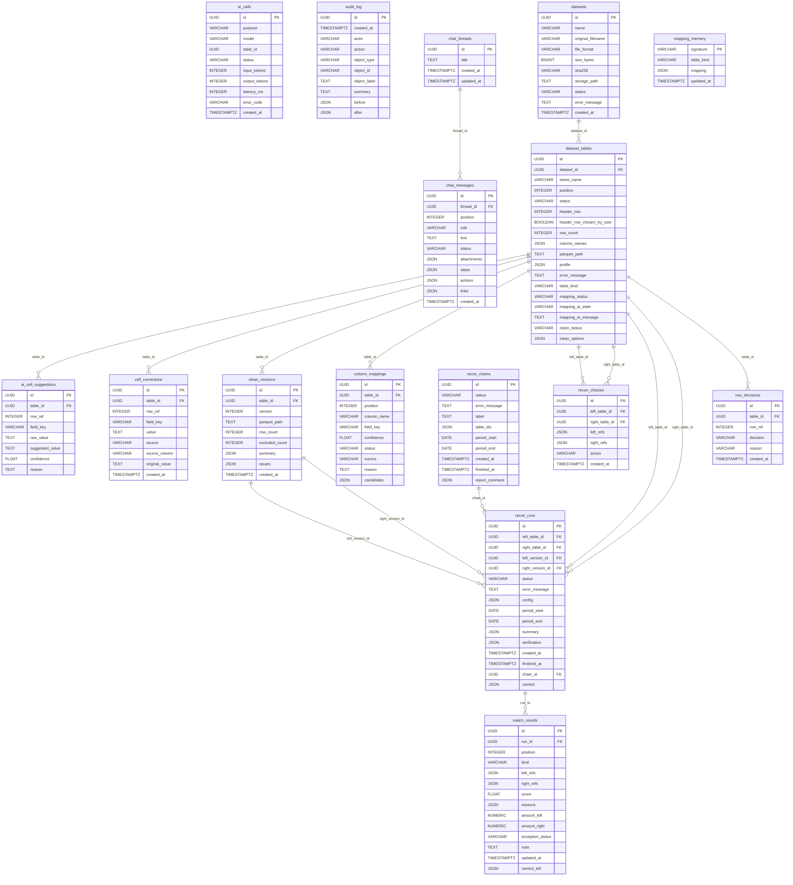

# Sơ đồ quan hệ (ER) — sinh tự động

Sinh từ `backend/studio/models.py` bằng `tools/export_data_docs.py`; không sửa tay.
Mỗi đường nối là một khóa ngoại: bảng con (nhiều) trỏ về bảng cha (một).

```mermaid
erDiagram
    ai_calls {
        UUID id PK
        VARCHAR purpose
        VARCHAR model
        UUID table_id
        VARCHAR status
        INTEGER input_tokens
        INTEGER output_tokens
        INTEGER latency_ms
        VARCHAR error_code
        TIMESTAMPTZ created_at
    }
    ai_cell_suggestions {
        UUID id PK
        UUID table_id FK
        INTEGER row_ref
        VARCHAR field_key
        TEXT raw_value
        TEXT suggested_value
        FLOAT confidence
        TEXT reason
    }
    audit_log {
        UUID id PK
        TIMESTAMPTZ created_at
        VARCHAR actor
        VARCHAR action
        VARCHAR object_type
        VARCHAR object_id
        TEXT object_label
        TEXT summary
        JSON before
        JSON after
    }
    cell_corrections {
        UUID id PK
        UUID table_id FK
        INTEGER row_ref
        VARCHAR field_key
        TEXT value
        VARCHAR source
        VARCHAR source_column
        TEXT original_value
        TIMESTAMPTZ created_at
    }
    chat_messages {
        UUID id PK
        UUID thread_id FK
        INTEGER position
        VARCHAR role
        TEXT text
        VARCHAR status
        JSON attachments
        JSON steps
        JSON actions
        JSON links
        TIMESTAMPTZ created_at
    }
    chat_threads {
        UUID id PK
        TEXT title
        TIMESTAMPTZ created_at
        TIMESTAMPTZ updated_at
    }
    clean_versions {
        UUID id PK
        UUID table_id FK
        INTEGER version
        TEXT parquet_path
        INTEGER row_count
        INTEGER excluded_count
        JSON summary
        JSON issues
        TIMESTAMPTZ created_at
    }
    column_mappings {
        UUID id PK
        UUID table_id FK
        INTEGER position
        VARCHAR column_name
        VARCHAR field_key
        FLOAT confidence
        VARCHAR status
        VARCHAR source
        TEXT reason
        JSON candidates
    }
    dataset_tables {
        UUID id PK
        UUID dataset_id FK
        VARCHAR sheet_name
        INTEGER position
        VARCHAR status
        INTEGER header_row
        BOOLEAN header_row_chosen_by_user
        INTEGER row_count
        JSON column_names
        TEXT parquet_path
        JSON profile
        TEXT error_message
        VARCHAR table_kind
        VARCHAR mapping_status
        VARCHAR mapping_ai_state
        TEXT mapping_ai_message
        VARCHAR clean_status
        JSON clean_options
    }
    datasets {
        UUID id PK
        VARCHAR name
        VARCHAR original_filename
        VARCHAR file_format
        BIGINT size_bytes
        VARCHAR sha256
        TEXT storage_path
        VARCHAR status
        TEXT error_message
        TIMESTAMPTZ created_at
    }
    mapping_memory {
        VARCHAR signature PK
        VARCHAR table_kind
        JSON mapping
        TIMESTAMPTZ updated_at
    }
    match_results {
        UUID id PK
        UUID run_id FK
        INTEGER position
        VARCHAR kind
        JSON left_refs
        JSON right_refs
        FLOAT score
        JSON reasons
        NUMERIC amount_left
        NUMERIC amount_right
        VARCHAR exception_status
        TEXT note
        TIMESTAMPTZ updated_at
        JSON carried_left
    }
    recon_chains {
        UUID id PK
        VARCHAR status
        TEXT error_message
        TEXT label
        JSON table_ids
        DATE period_start
        DATE period_end
        TIMESTAMPTZ created_at
        TIMESTAMPTZ finished_at
        JSON report_comment
    }
    recon_choices {
        UUID id PK
        UUID left_table_id FK
        UUID right_table_id FK
        JSON left_refs
        JSON right_refs
        VARCHAR action
        TIMESTAMPTZ created_at
    }
    recon_runs {
        UUID id PK
        UUID left_table_id FK
        UUID right_table_id FK
        UUID left_version_id FK
        UUID right_version_id FK
        VARCHAR status
        TEXT error_message
        JSON config
        DATE period_start
        DATE period_end
        JSON summary
        JSON verification
        TIMESTAMPTZ created_at
        TIMESTAMPTZ finished_at
        UUID chain_id FK
        JSON carried
    }
    row_decisions {
        UUID id PK
        UUID table_id FK
        INTEGER row_ref
        VARCHAR decision
        VARCHAR reason
        TIMESTAMPTZ created_at
    }
    dataset_tables ||--o{ ai_cell_suggestions : "table_id"
    dataset_tables ||--o{ cell_corrections : "table_id"
    chat_threads ||--o{ chat_messages : "thread_id"
    dataset_tables ||--o{ clean_versions : "table_id"
    dataset_tables ||--o{ column_mappings : "table_id"
    datasets ||--o{ dataset_tables : "dataset_id"
    recon_runs ||--o{ match_results : "run_id"
    dataset_tables ||--o{ recon_choices : "left_table_id"
    dataset_tables ||--o{ recon_choices : "right_table_id"
    recon_chains ||--o{ recon_runs : "chain_id"
    dataset_tables ||--o{ recon_runs : "left_table_id"
    clean_versions ||--o{ recon_runs : "left_version_id"
    dataset_tables ||--o{ recon_runs : "right_table_id"
    clean_versions ||--o{ recon_runs : "right_version_id"
    dataset_tables ||--o{ row_decisions : "table_id"
```
